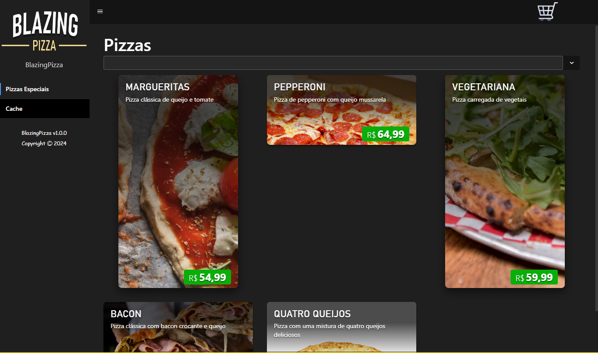

# Blazing

## 🧐 Visão Geral

Blazing é um aplicativo web desenvolvido em Blazor, projetado para ser um software genérico de e-commerce que abrange diversos segmentos. O aplicativo incluirá funcionalidades como listagem de produtos de forma geral, uma abordagem abstrata para produtos, carrinho de compras, formas de pagamento e integrações com APIs para a geração de notas fiscais, como a Nuvem Fiscal.

O projeto também conta com uma estrutura de banco de dados para armazenar informações relevantes e adota técnicas de arquitetura limpa, com a intenção de escalar para diferentes segmentos, mantendo boas práticas de separação por camadas. Embora eu ainda esteja aprendendo sobre front-end, essas funcionalidades são previstas para a primeira etapa e podem ser ajustadas ao longo do desenvolvimento, sempre com foco em melhorias contínuas.

Este software será de código aberto, com o objetivo de ajudar a comunidade e explorar diferentes abordagens de programação. A ideia é fornecer um projeto base que ofereça uma visão prática e realista do desenvolvimento, indo além de um simples CRUD ou das cópias de projetos comumente vendidos em cursos. É uma oportunidade para demonstrar as etapas de um projeto completo e complexo, algo que não encontrei em outros lugares, especialmente no início da minha jornada.


## ⚙️ Funcionalidades Principais

1. **Listagem de Produtos:**
   - A aplicação permite visualizar todos os produtos disponíveis.

2. **Carrinho de Compras:**
   - Os usuários podem adicionar produtos ao carrinho de compras e realizar pedidos.

3. **Filtragem :**
   - Existe a opção de filtrar por nome, preço, disponibilidade, entre outros. Isso facilita a busca para os clientes.

4. **Delivery e entrega :**
   - A aplicação oferece opções de entrega tanto para o segmento de delivery quanto para entregas em geral.

5. **Formas de pagamento :**
   - Aborda todas as opções de pagamento disponíveis.

5. **Nota fiscal :**
   - Inclui a geração básica de notas fiscais, com integração com um aplicativo externo para gerenciar o site de e-commerce.

## 🔋 Status do Projeto

O projeto está em fase inicial, com foco na estruturação de testes antes das implementações mais complexas, como a integração com o banco de dados. Atualmente, estou trabalhando na base do projeto com operações básicas CRUD, sempre buscando uma abordagem mais performática. Além disso, estamos utilizando a biblioteca xUnit para testes unitários durante a fase de implementação e DTOs (Data Transfer Objects) para a transferência de dados. Seu feedback é sempre bem-vindo.

## 🆕 Atualizações Recentes

Foi adicionado bibliotecas de logs. Para ajudar no detalhamento de Exceções: Os logs de erro contêm stack traces detalhados que ajudam a identificar a origem do problema. Isso é necessário para depurar exceções e corrigir bugs. Informações contextuais Logs como RequestId, RequestPath, e ConnectionId para ajudar a rastrear a execução das requisições e identificar problemas específicos relacionados a uma requisição. Registro de sucesso e falhas das operações: Logs informativos como “Produtos adicionados com sucesso” ajudam a monitorar operações bem-sucedidas e a verificar se o comportamento da aplicação está ocorrendo com o esperado. Registro de ips informações sobre o endereço IP do usuário para caso de auditoria. 

Os logs estruturados estão em fase inicial de implementação, sendo salvos em arquivos no formato JSON, localizados em ./Blazing.Api/logs (por exemplo, log-development-20240816.json). Além disso, as operações críticas, como exceções, são salvas tanto no arquivo quanto no banco de dados SQL Server. No entanto, estou em dúvida sobre manter os logs em um banco de dados relacional.

Bibliotecas utilizadas:


## Roadmap

### 📖 Próximas Releases

1. **API:**
   - ✔️ Etidades definidas com propriedades obrigatória.
   - ✔️ Teste unitário e implementações CRUD Product.
   - ✔️ Teste unitário e implementações CRUD Category. 
   - ✔️ Todo código comentado. 
   - ✔️ Arquitetura limpa.
   - ✔️ Teste Automatizados.
   - ✔️ Tratamento de erros do dominio Product .
   - ✔️ Tratamento de erros middleware.
   - ⏳ Implementar logs.
   - ⏳ Teste unitário e implementações CRUD para AddCartItem. 
   - ⏳ Teste unitário e implementações CRUD para Address.
   - ⏳ Teste unitário e implementações CRUD para Assessment. 
   - ⏳ Teste unitário e implementações CRUD para Attribute. 
   - ⏳ Teste unitário e implementações CRUD para Availability.
   - ⏳ Teste unitário e implementações CRUD para CartItem.
   - ⏳ Teste unitário e implementações CRUD para Dimensions.
   - ⏳ Teste unitário e implementações CRUD para Image.
   - ⏳ Teste unitário e implementações CRUD para Revision.
   - ⏳ Teste unitário e implementações CRUD para ShoppingCart.
   - ⏳ Teste unitário e implementações CRUD para UpdateCartQuantity.
   - ⏳ Teste unitário e implementações CRUD para User com implementação de autenticação via IdentityUser Asp Net Core, Google Sign-In.
   - ⏳ Criação de logs. 
   - ⏳ Teste e criação do controllers Product.
   - ⏳ Criação das migrations.

2. **Cadastro de Usuário:**
   - Implementar a página de cadastro de usuário para facilitar o processo de compra.

### 🚀 Futuras Implementações

1. **Aplicativo de Gerenciamento Interno:**
   - Desenvolver um aplicativo separado para gerenciar o site e-commerce, monitoramento e cadastros de produtos, usuários e muito mais no site principal.

## 🤓 Boas Práticas

O projeto Blazing segue várias boas práticas de desenvolvimento para garantir qualidade e eficiência, incluindo:

 - Separação Clara de Responsabilidades: O projeto adota uma arquitetura em camadas, separando claramente as responsabilidades entre a apresentação, a lógica de aplicação e a camada de dados. Isso facilita a manutenção, a escalabilidade e a compreensão do código.

 - Uso de Armazenamento em Cache: São aplicadas técnicas de armazenamento em cache para otimizar o desempenho da aplicação, reduzindo o tempo de resposta e melhorando a experiência do usuário. Isso ajuda a minimizar a carga no servidor e a melhorar a eficiência das operações.

 - Padrões de Nomenclatura Consistentes: O projeto utiliza padrões de nomenclatura consistentes e legíveis para facilitar a compreensão do código e promover boas práticas de codificação. Nomes de variáveis, métodos e classes são claros e descritivos, o que melhora a legibilidade e a manutenção do código.

 - Documentação e Comentários: Todo o código é bem comentado e documentado para fornecer contexto e explicações sobre a funcionalidade dos métodos e classes. Isso ajuda os desenvolvedores a entender rapidamente o propósito do código e a colaborar de forma mais eficaz.

 - Validação e Tratamento de Erros: São implementadas práticas robustas de validação e tratamento de erros para garantir a integridade dos dados e a confiabilidade da aplicação. Isso inclui validações em nível de entrada e tratamento apropriado de exceções.

 - Testes Abrangentes: O projeto é acompanhado por uma suíte abrangente de testes unitários e de integração, garantindo que as funcionalidades sejam validadas em diferentes camadas e que qualquer mudança no código não introduza novos problemas.

## 💬 Contribuindo

Contribuições para o projeto são bem-vindas! Se você deseja contribuir, siga estes passos:
1. Faça um fork do repositório.
2. Crie uma branch para sua contribuição (`git checkout -b feature/nome-da-feature`).
3. Faça as alterações necessárias e adicione testes, se aplicável.
4. Envie um pull request para revisão.

## 💻 Requisitos do Ambiente

Certifique-se de que o seu ambiente atende aos seguintes requisitos antes de iniciar o desenvolvimento no projeto BlazingPizzaria:

- **.NET SDK:** Versão 8.0 ou superior
- **Entity Framework Core:** Versão 8.0.6 ou superior
- **Entity Framework Core Design:** Versão 8.0.6 ou superior
- **Entity Framework Core Tools:** Versão 8.0.6 ou superior
- **Entity Framework SqlServer:** Versão 8.0.6 ou superior
- **SQL Server:** Versão 2019 ou superior (ou outro banco de dados compatível com Entity Framework Core)

## 📚 Bibliotecas Utilizadas

O projeto BlazingPizzaria faz uso das seguintes bibliotecas e ferramentas:

- **Microsoft.AspNetCore.Blazor:** Versão 8.0.0
- **Microsoft.EntityFrameworkCore:** Versão 8.0.6
- **Newtonsoft.Json:** Versão 13.0.1
- **Bootstrap:** Versão 5.2.2
- **IJSRuntime:** Biblioteca padrão do Blazor
- **Radzen.Blazor:** Versão 4.32.9
- **Swashbuckle.AspNetCore:** Versão 6.2.3 (para documentação com Swagger)
- **AutoMapper:** Versão 13.0.1 (para mapeamento de entidades para DTOs)

## ⚙️ Configuração do Ambiente de Desenvolvimento

1. **Instalação do .NET SDK:**
   - Baixe e instale o .NET SDK 8.0 a partir do [site oficial da Microsoft](https://dotnet.microsoft.com/download).

2. **Layout e componentes:**
   - Execute o seguinte comando no terminal no diretório do projeto:
     ```
     dotnet add package Radzen.Blazor --version 4.32.9
     ```

3. **Configuração do Banco de Dados:**
   - Utilize o SQL Server Management Studio 2022 ou ferramenta similar para configurar o banco de dados conforme o arquivo de migração disponível no projeto.

4. **Execução do Projeto:**
   - Abra o terminal na pasta do projeto e execute o seguinte comando para iniciar a aplicação:
     ```
     dotnet watch run
     ```

## 📧 Contato

Para mais informações ou suporte, entre em contato com a equipe de desenvolvimento em [matheusprgc@gmail.com](mailto:matheusprgc@gmail.com).
